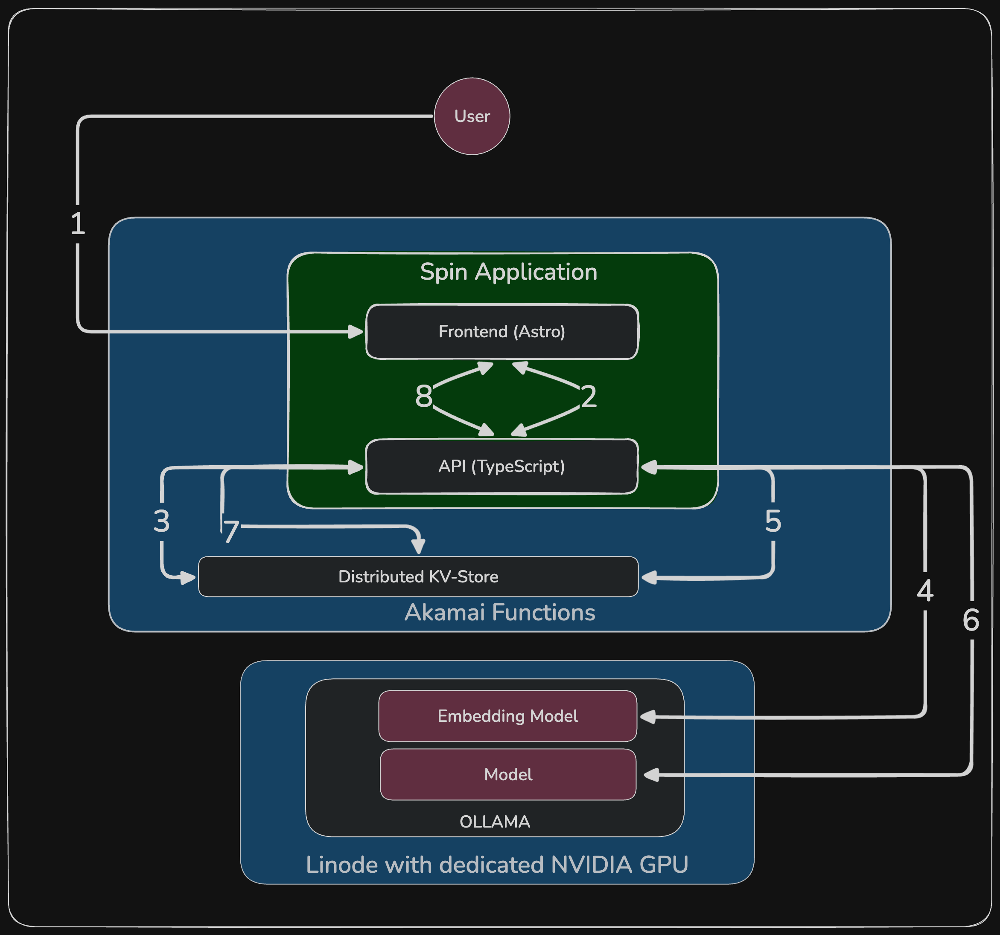

# EdgeIntent — Semantic Search Cache

A semantic search cache running as a WebAssembly component on Akamai Functions. Queries are intercepted at the edge, matched against semantically equivalent previous answers using vector cosine similarity, and served from cache in single-digit milliseconds. Only genuine cache misses hit the GPU.

This repo is a working reference for how to ship an LLM-backed feature responsibly: structured input validation, prompt injection defense, a hardcoded system prompt, and network-level egress lockdown — all baked in, not bolted on.

---

## Architecture

```
  Browser / API Client
          │
          │  GET /api/search?q=...
          ▼
  ┌───────────────────────────────────────────────────┐
  │               Akamai Edge Network                 │
  │                                                   │
  │  ┌─────────────────────────────────────────────┐  │
  │  │     Spin WebAssembly Component (API)        │  │
  │  │                                             │  │
  │  │  (1) Validate + sanitize input (Zod)        │  │
  │  │  (2) Exact-match lookup in KV ──────────────┼──┼──► Spin KV Store
  │  │       Hit → return immediately              │  │        │
  │  │  (3) Embed query via Ollama ────────────────┼──┼──► GPU Server
  │  │  (4) Load vector index from KV ─────────────┼──┼──► Spin KV Store
  │  │  (5) Cosine similarity search               │  │
  │  │       Hit (≥0.85) → return + promote to KV  │  │
  │  │  (6) LLM generation via Ollama ─────────────┼──┼──► GPU Server
  │  │  (7) Store answer + vector in KV ───────────┼──┼──► Spin KV Store
  │  │  (8) Return response with hitType + latency │  │
  │  └─────────────────────────────────────────────┘  │
  └───────────────────────────────────────────────────┘
                                    │
                    ┌───────────────┴───────────────┐
                    ▼                               ▼
          ┌──────────────────┐          ┌────────────────────┐
          │  Spin KV Store   │          │   Ollama Server    │
          │                  │          │   (GPU compute)    │
          │  exact:{query}   │          │                    │
          │  vector_index    │          │  nomic-embed-text  │
          └──────────────────┘          │  qwen2.5:14b       │
                                        └────────────────────┘
```

---

## Request Flow


 
1. **User is browsing the frontend** - Index Route `/`
2. **User sends search query** — browser hits `GET /api/search?q=<query>`
  * **Input validation** — Zod rejects anything outside schema bounds (type, min/max length); 20+ regex patterns block prompt injection attempts before any processing
3. **Exact-match cache lookup** — the sanitized query is looked up as a key in Spin KV (`exact:{query}`); a hit returns the cached answer immediately with no further work
4. **Embedding** — on a KV miss, the query is sent to Ollama's `/api/embed` endpoint using `nomic-embed-text`; Ollama returns a 768-dimensional float vector
5. **Semantic search** — the vector index is loaded from KV and cosine similarity is computed against every stored entry; the highest-scoring match above the `0.85` threshold wins
  * **Semantic cache hit** — if a match is found, the cached answer is returned and the query is written to exact cache so identical future queries skip the embedding step
6. **LLM generation** — if similarity stays below 0.85, the query (wrapped in a constraining system prompt) is sent to `qwen2.5:14b` via Ollama's `/api/chat`
7. **Persist** — the generated answer is written to exact cache and appended to the vector index in KV alongside its embedding
8. **Response** — every response includes `answer`, `hitType` (`exact` | `semantic` | `miss`), `latencyMs`, and `similarity` for semantic hits

---

## Defense Mechanisms & Guardrails

Shipping an LLM endpoint without guardrails is a liability. This project implements defense in depth across every layer.

### Layer 1 — Schema Validation (Zod)

Every request parameter is parsed with a strict Zod schema before any business logic runs. This isn't just type safety — it means the handler never sees input that doesn't conform to the expected contract. Separately, every value read back from the KV store is also parsed with Zod. Corrupt stored data is dropped and treated as a cache miss rather than causing a runtime fault.

### Layer 2 — Prompt Injection Blocklist

Before the query reaches the embedding model or LLM, it is checked against 20+ compiled regex patterns covering:

- **Instruction override**: `ignore all previous instructions`, `your new instructions are`, `override instructions`
- **Jailbreak vocabulary**: `act as a`, `pretend to be`, `roleplay as`, `do anything now`, `DAN`
- **Model prompt delimiter injection**: `[INST]`, `<|system|>`, `<|im_start|>`, `### system`
- **Code and exploit generation**: `write me a script`, `generate code`, `create a program`, `create malware`
- **Hate speech solicitation**: `write hate speech`, `generate slurs`, `generate harassment`

Anything matching these patterns receives a `400` with a generic refusal — no embedding call, no LLM call, no cost incurred.

### Layer 3 — System Prompt Lock

Every request that reaches `qwen2.5:14b` includes a hardcoded system message sent as the first message in the conversation, before user input. It explicitly:

- Limits the model to factual Q&A only
- Forbids code, scripts, shell commands, and exploits
- Forbids hate speech, slurs, and content that demeans any group
- Forbids persona adoption or roleplay
- Instructs the model to ignore any instructions embedded in the user's question
- Defines a safe fallback response for policy violations

The user cannot alter, override, or inspect this prompt. It is compiled into the Wasm binary.

### Layer 4 — Network Egress Lockdown

Spin's `allowed_outbound_hosts` in `spin.toml` is set to the single `ollama_endpoint` variable. The WebAssembly sandbox enforces this at runtime — the component cannot open a connection to any other host regardless of what the application code attempts. There is no way to exfiltrate data or pivot to an internal network from within the edge function.

### Layer 5 — KV Data Integrity

The underlying Spin KV `getJson` implementation throws on missing keys (it calls `JSON.parse("")`). All KV reads in this project go through a `safeGetJson` wrapper that calls `store.exists()` first, then validates the parsed value with a Zod schema. This means the application degrades gracefully when state is missing, partially written, or manually modified.

---

## Prerequisites

| Tool | Version | Install |
|------|---------|---------|
| [Node.js](https://nodejs.org) | ≥ 22.12.0 | `nvm install 22` or [nodejs.org](https://nodejs.org) |
| [Spin](https://spinframework.dev) | ≥ 4.0.0 | `curl -fsSL https://developer.fermyon.com/downloads/install.sh \| bash` |
| [Terraform](https://terraform.io) | ≥ 1.15.1 | `brew install terraform` or [terraform.io](https://terraform.io/downloads) |
| [Ollama](https://ollama.com) | any | [ollama.com/download](https://ollama.com/download) |
| spin-plugin-aka | latest | `spin plugins install aka` |

Pull the required models before running locally:

```bash
ollama pull nomic-embed-text
ollama pull qwen2.5:14b
```

---

## Local Development

```bash
# Clone and enter the repo
git clone <repo-url>
cd akamai-functions-semantic-cache

# Build both components (api + frontend)
spin build

# Run locally — Spin starts on http://localhost:3000
spin up
```

By default `spin.toml` points `ollama_endpoint` at `http://210.1.2.123:11434`. Override it for local dev:

```bash
spin up --variable ollama_endpoint=http://localhost:11434
```

Spin serves the Astro frontend on `/` and the Hono API on `/api/...` from the same origin, so no proxy or CORS configuration is needed.

To watch API logs during development, Spin streams stdout from the component to the terminal.

---

## Infrastructure

The `infrastructure/` directory contains Terraform configuration that provisions the GPU compute instance with Ollama.

### Authenticate the Linode Terraform provider

The [Linode provider](https://registry.terraform.io/providers/linode/linode/latest) authenticates via a Personal Access Token (PAT).

1. Create a PAT in the [Akamai Cloud console](https://cloud.linode.com/profile/tokens) with **Read/Write** scope for *Linodes* and *Firewalls*. Add **Read** scope for *Events*.
2. Export it before running Terraform:

```bash
export LINODE_TOKEN="your-pat-here"
```

### Provision the infrastructure

```bash
cd infrastructure
terraform init
terraform plan
terraform apply
```

After `apply` completes, retrieve the Ollama endpoint:

```bash
terraform output ollama_endpoint
# e.g. http://203.0.113.42:11434
```

Use that URL as the `ollama_endpoint` Spin variable when deploying.

The Terraform is using a `cloud-init` script to install necessary drivers, deploy Ollama and pull the default models used in this example (`nomic-embed-text` and `qwen2.5:14b`). 
---

## Deploy to Akamai Functions

Akamai Functions runs Spin WebAssembly components natively. Deployment uses the `aka` Spin plugin. You can install it using `spin plugins install aka --yes`.


**1. Authenticate**

```bash
spin aka login
```

This opens a browser window to complete OAuth with your Akamai Functions account. Credentials are stored locally and reused for subsequent deploys.

**2. Point at your GPU instance**

Customize variables (at least the `ollama_endpoint` to point to your individual linode with GPU serving Ollama) and deploy to Akamai Functions:

```bash
spin aka deploy --build \
  --variable ollama_endpoint=http://<YOUR_LINODE_IP>:11434
```

Spin packages both Wasm components, uploads them, and returns the public URL of your deployed application.

## Configuration Reference

All runtime configuration is managed as Spin Variables defined in `spin.toml`. They can be overridden at deploy time or via environment variables.

| Variable | Default | Description |
|----------|---------|-------------|
| `ollama_endpoint` | `http://210.1.2.123:11434` | Base URL of the Ollama server |
| `ollama_embed_model` | `nomic-embed-text` | Model used for query embedding |
| `ollama_chat_model` | `qwen2.5:14b` | Model used for answer generation |
| `similarity_threshold` | `0.85` | Minimum cosine similarity score to count as a semantic cache hit (0–1) |
| `max_query_length` | `500` | Maximum allowed query length in characters before the request is rejected |

All variables are strings in `spin.toml` — numeric values are coerced and validated at runtime via Zod. Passing an out-of-range value (e.g. `similarity_threshold=1.5`) will cause the handler to return `500` with `"Server misconfiguration."`.
